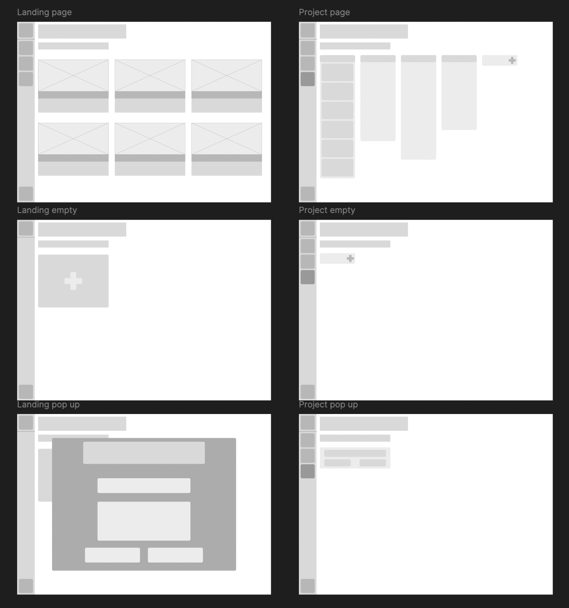
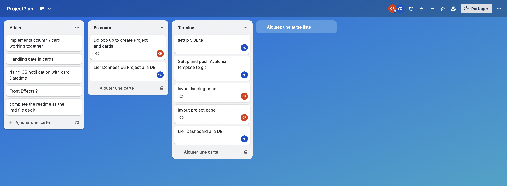
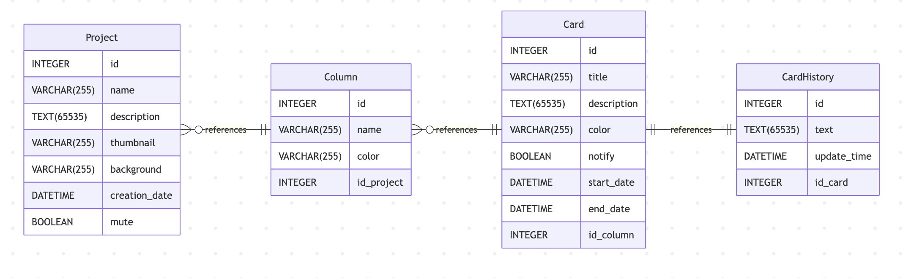
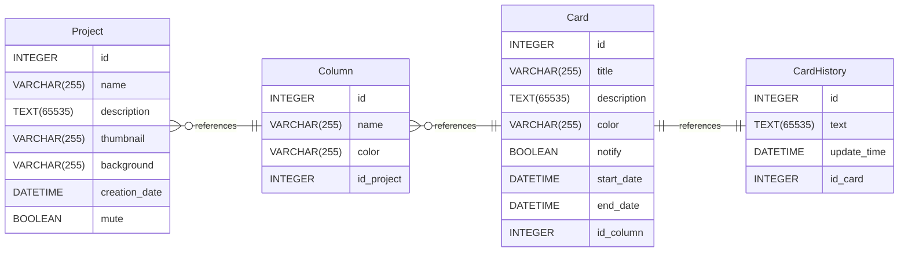
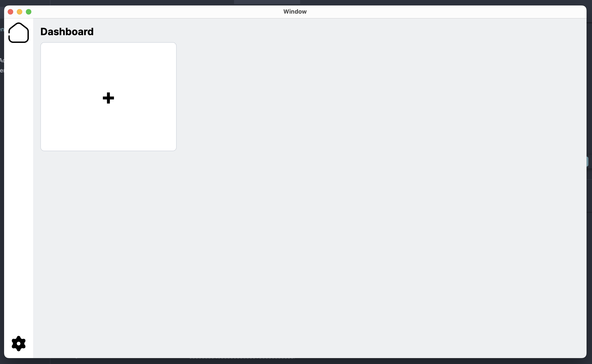
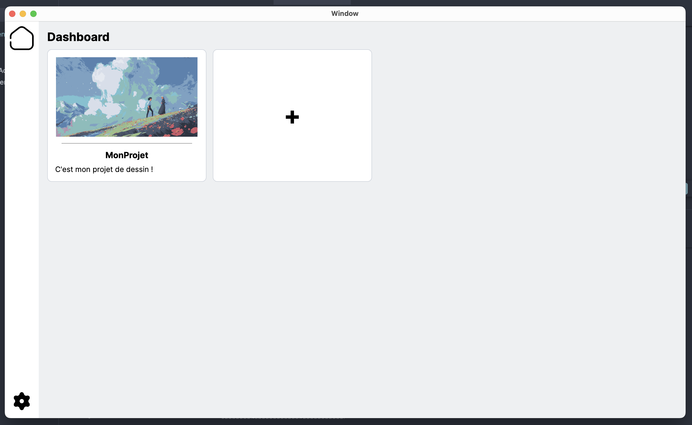
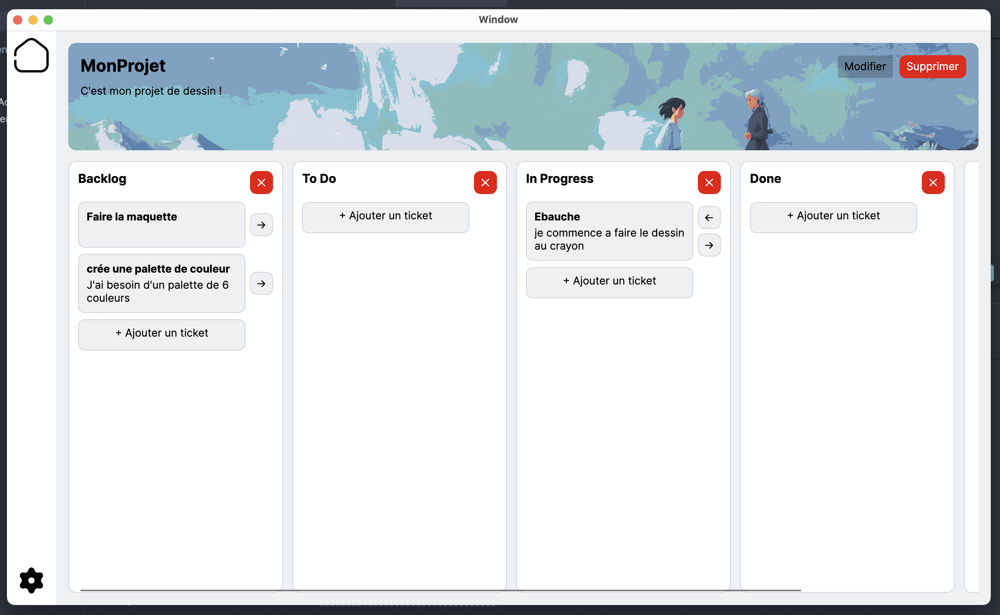
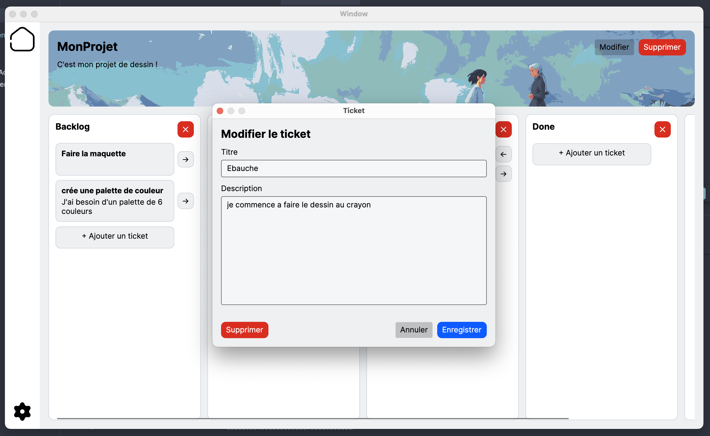

# ProjectPlan

## Auteurs
* **Omar YASSINE** - (Rôle : Dev Backend) - [yomarhub · GitHub](https://github.com/yomarhub)
* **Clément RAMOS** - (Rôle : UI/UX Designer + Dev Backend) - [clement-ramos · GitHub](https://github.com/clement-ramos)

---

##  Description
**Pitch :** Mini-Trello **hors ligne** : un Kanban local (non coopératif) pour organiser ses tâches sans serveur.

**Description détaillée :**
ProjectPlan est une application de bureau (Windows/macOS/Linux) développée avec **Avalonia UI** dont l’objectif est de proposer un **Kanban local**, inspiré de Trello, pour gérer ses tâches **en local** (sans collaboration en temps réel et sans backend). L’idée est de pouvoir créer un ou plusieurs tableaux, y organiser des listes (colonnes) et des cartes (tâches), puis déplacer les cartes pour suivre l’avancement.

### Fonctionnalités Clés

- Visualisation des projets dans un dashboard
- Création de projects avec des colonnes par défaut ("Backlog", "To Do", "In Progress", "Done")
- Création de tâches dans n'importe quelle colonne
- Déplacement des tâches selon l'avancement
- Réduction de l'application dans la zone de notification (tray icon)
- Fermeture/Ouverture de l'app depuis la zone de notification (clique droit)

## Conception & Design
> Lien vers la maquette complète.
> **[Voir la maquette sur Figma](https://www.figma.com/design/ihkBEva17vLyZCR2WKLMkK/ProjectPlan?node-id=0-1&t=20UBtoOh2cq15HFe-1)**



### Organisation du projet

> Lien vers le Trello : **[Voir le Trello](https://trello.com/invite/b/69959b8491d6cf68c640930f/ATTIa3e1e817efe85e846b0e7cec603c56c42ACFDFCD/projectplan)**



## Architecture & UML




Mermaid code :



## Stack Technique
* **Langage :** C#
* **Framework UI :** Avalonia UI 11.3.12 (Desktop)
* **Architecture :** MVVM (CommunityToolkit.Mvvm)
* **Runtime :** .NET `net10.0`
* **Outils :** VS Code / JetBrains Rider, Git/GitHub, Figma

---

## Démonstration 


Empty Dashboard: 
Dashboard: 
Project: 
New Task: 

---

## Installation & Lancement
Guide pas-à-pas pour qu'un développeur puisse lancer votre projet.

### Prérequis
- **.NET SDK 10** (compatible avec `net10.0`)
- (Optionnel) VS Code + extension C# / Avalonia

### Commandes

```bash
# Cloner le dépôt
git clone https://github.com/yomarhub/ProjectPlan

cd ProjectPlan

# Restaurer les dépendances
dotnet restore

# Compiler
dotnet build

# Lancer l'application
dotnet run
```

---

## Section IA & Méthodologie

### 1. Prompts Utilisés
- "Comment implémenter une navigation simple MVVM dans Avalonia (ContentControl + ViewLocator) ?" -> Mise en place de la navigation.
- "Comment ouvrir un File Picker natif dans Avalonia et récupérer un stream ?" -> Implémentation du choix d’image.
- "Donne un exemple de ViewModel avec CommunityToolkit.Mvvm (ObservableProperty, RelayCommand)." -> Boilerplate MVVM.

### 2. Modifications Manuelles & Debug
- Adaptation des exemples de documentation Avalonia pour utiliser `StorageProvider.OpenFilePickerAsync` et filtrer les extensions d’images.
- Gestion des erreurs de chargement d’image (fallback si lecture impossible).

### 3. Répartition Code IA vs Code Humain
- **Boilerplate / Config :** 100% Humain
- **Logique Métier (navigation + flux de création) :** 75% Humain
- **Interface (UI XAML) :** 40% IA

> Note : certaines parties ont été assistées avec **GitHub Copilot (GPT-5.2)**, puis revues et ajustées manuellement.

---

## Auto-Évaluation
- **Ce qui fonctionne bien :** navigation, dashboard de cartes, création de projet/colonne/tâche + sélection et preview d’image, déplacement des tâches.
- **Difficultés rencontrées :** structure MVVM, système de notif, drag & drop (task).
- **Si c'était à refaire :** plus de temps, plus d'animation/dynamisme, ajouter le drag&drop.
